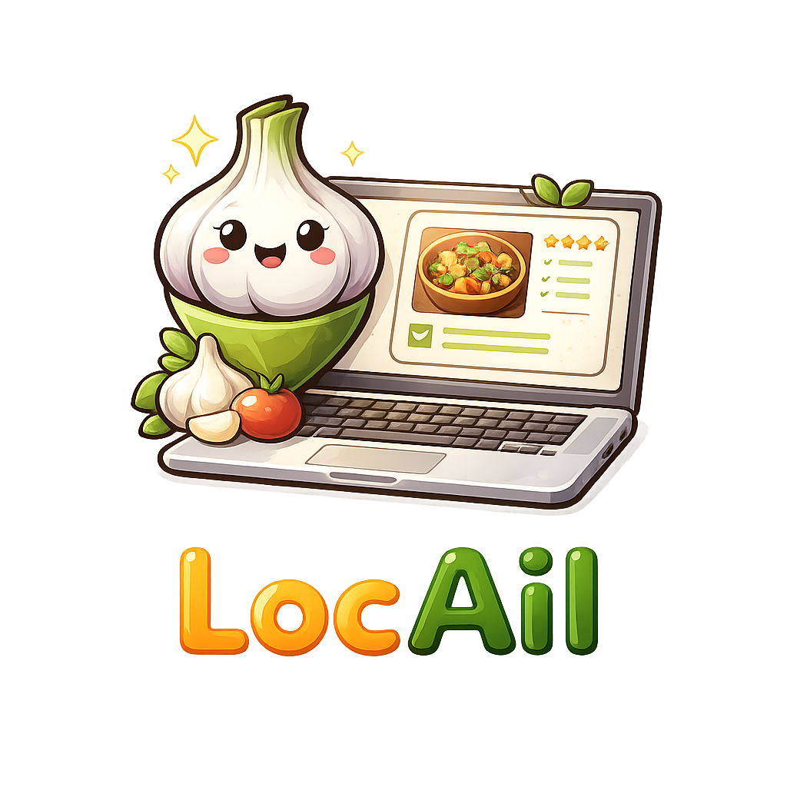

# 

**LocAil** = **Local** + **Ail** (French for *garlic*) — a nod to the first ingredient that inspired it.

LocAil is a simple REST API that suggests meal ideas based on ingredients you have in your fridge. You tell it what you have, and it uses a local AI model to come up with practical recipe ideas.

It is intentionally a minimal example project showing how to integrate **Ollama** with **Spring AI** in a Spring Boot application — no cloud, no API keys, everything runs locally on your machine.

---

## What it does

Send a list of ingredients, get back meal suggestions:

```http
POST /api/suggestions
Content-Type: application/json

{
  "ingredients": ["chicken", "tomatoes", "garlic"]
}
```

```json
{
  "suggestion": "With chicken, tomatoes, and garlic you could make:\n1. Garlic tomato chicken stir-fry..."
}
```

---

## Tech stack

| Layer | Technology |
|-------|-----------|
| Framework | Spring Boot 3.4.0 |
| AI integration | Spring AI 1.0.0 |
| LLM runtime | Ollama (local) |
| Model | llama3.2 |
| API docs | Springdoc OpenAPI / Swagger UI |

---

## Prerequisites

- Java 21+
- Maven 3.9+
- [Ollama](https://ollama.com) installed and running

## Running locally

**1. Start Ollama and pull the model**
```bash
ollama serve
ollama pull llama3.2
```

**2. Start the application**
```bash
mvn spring-boot:run
```

**3. Open Swagger UI**

Navigate to [http://localhost:8080/swagger-ui/index.html](http://localhost:8080/swagger-ui/index.html) to try the API interactively.

Or use curl:
```bash
curl -X POST http://localhost:8080/api/suggestions \
  -H "Content-Type: application/json" \
  -d '{"ingredients":["chicken","tomatoes","garlic"]}'
```

---

## Project structure

```
src/main/java/com/locail/
├── LocAilApplication.java               # Spring Boot entry point
├── controller/
│   └── MealSuggestionController.java    # POST /api/suggestions
├── model/
│   └── IngredientsRequest.java          # Request body record
└── service/
    └── MealSuggestionService.java       # Spring AI ChatClient logic
```

---

## How Spring AI + Ollama works here

`MealSuggestionService` injects a `ChatClient` that Spring AI auto-configures from `application.properties`:

```properties
spring.ai.ollama.base-url=http://localhost:11434
spring.ai.ollama.chat.options.model=llama3.2
```

The service sets a system prompt (culinary assistant) and forwards the user's ingredient list as a user message. Spring AI handles the HTTP communication with the Ollama server transparently — swapping to a different model or provider (OpenAI, Anthropic, etc.) would only require changing the dependency and properties.